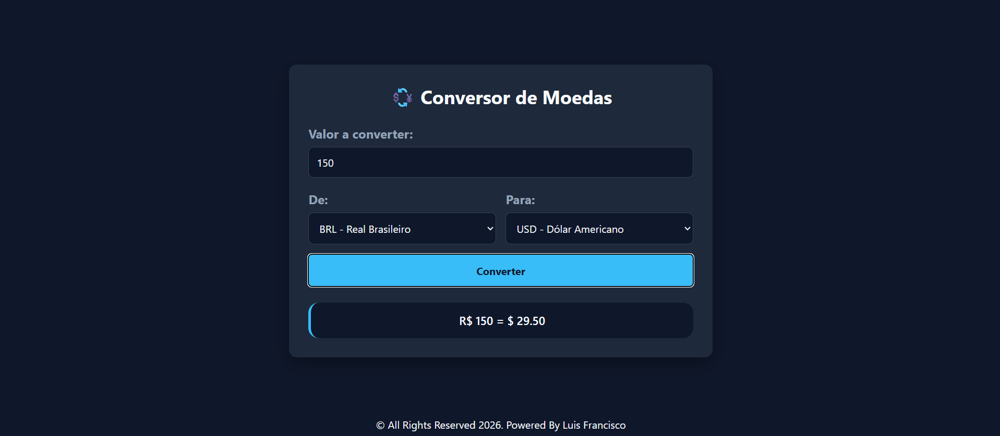
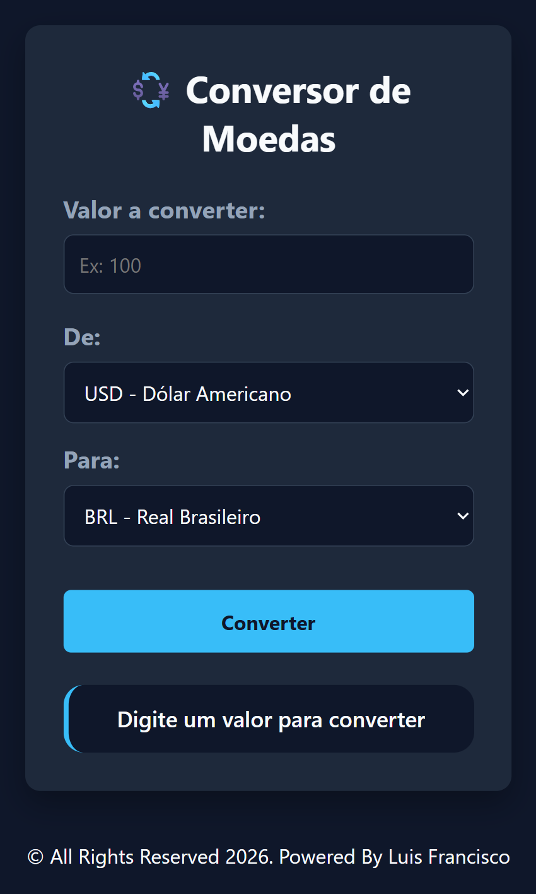

# 💱 Currency Converter

A modern, responsive, and elegant web application for real-time currency conversion, featuring live exchange rate API integration, dynamic symbol mapping, and seamless user experience handling.

---

## 📸 Preview

<p align="center">
  
  
</p>

## 🚀 Technologies Used

- **HTML5:** Semantic structuring of the application layout, utilizing input fields, select dropdowns, action buttons, and responsive wrapper containers.
- **CSS3:** Modern styling utilizing fluid transitions, custom Google Fonts, structural Flexbox alignment, and responsive media queries for cross-device compatibility.
- **JavaScript (ES6+):** Pure DOM manipulation and asynchronous event-driven programming implementing:
  - Asynchronous data fetching (`fetch` API and `async/await`) to retrieve live exchange rates from external REST endpoints.
  - Robust error handling using `try...catch` blocks to manage network failures gracefully.
  - Dynamic mapping of currency symbols (`BRL`, `USD`, `EUR`, `GBP`) and real-time DOM updates.

---

## 🧠 Core Learnings & Implementation Concepts

The main objective of this project was to master asynchronous JavaScript operations, live REST API consumption, and robust error handling in vanilla JavaScript. Key architectural concepts mastered include:

1. **Asynchronous API Requests (`async/await` & `fetch`):** Interfacing with live financial endpoints to request up-to-date currency conversion rates dynamically based on user selection.

2. **Error Handling Architecture (`try...catch`):** Implementing structured exception management to safely catch network drops, invalid responses, or API downtime without breaking application flow.

3. **DOM State & Layout Synchronization:** Coordinating real-time UI updates to instantly display converted values alongside mapped currency symbols (`$` , `R$`, `€`, `£`).

---

## 📦 How to Run the Project Locally

### 1. Clone this repository:

```bash
git clone https://github.com/luisfrancisco2b/currency-convertor
```

### 2. Navigate to the project folder

```bash
cd currency-convertor
```

### 3. 🚀 Running the Project

```bash
Since this is a front-end application, you can run it directly.

Open the `index.html` file in your browser, or run it using an extension like **Live Server** in VS Code:

http://127.0.0.1:5500/index.html
```

## 👨‍💻 Author

Luis Francisco